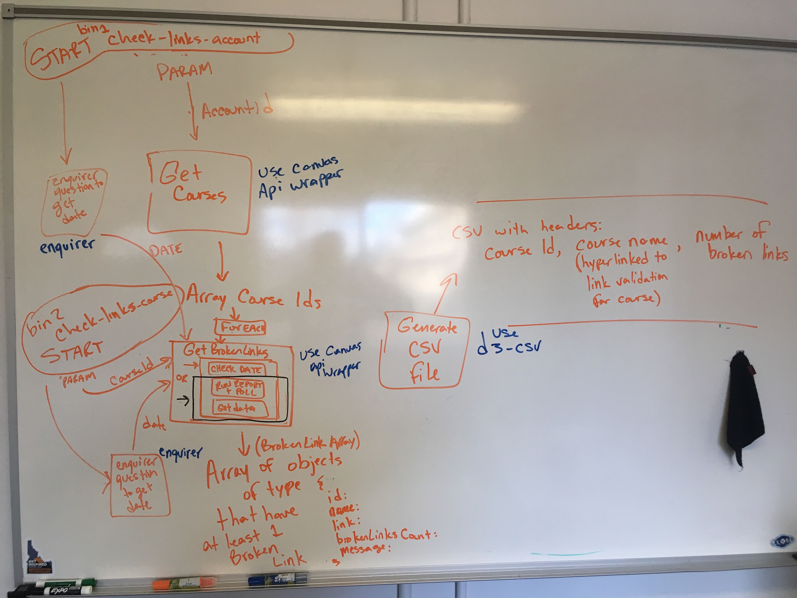

# 02 Preliminary Design

> "First comes thought; then organization of that thought, into ideas and plans; then transformation of those plans into reality. The beginning, as you will observe, is in your imagination." - Napoleon Hill

## Purpose and Overview
This is the second stage of a project. This document that is output from this stage is the Key Components Doc. The purpose of this stage is:

1. Help the developer learn how to design so that code is:
     - Maintainable
     - Scalable
     - Reusable
     - Easy to Understand
1. Fail Fast (by sharing ideas and getting feedback)
1. Distributable work (portions OR all of the project can be given out to others to do)
1. Make sure we are not starting from scratch unless we have to. (Checking approved libraries first).
1. Where we can, open the scope of the project to general use as a tool that we can add to our tool belt.

### Deliverables
1. Key Components Document [template](../6.%20Templates/02_KeyComponentsDoc.md)

### Time Estimate: 1-3 hours
- *Depending on the project and knowledge of the developer, the time estimate may differ.*

Developers should anticipate that their design will change after conversations with more senior developers. They should approach the approval process with a "How can my design be better?" attitude.

## Tutorial of Process

1. Create the Magic Box Chart and Corresponding Explanation

     The term "Magic Box Chart" is used in this office to mean a chart that has the major components of the project (functions, objects, etc.) represented as boxes with arrows to explain the relationships. You have a lot of flexibility in creating this chart. The most important part, is the chart must be understandable. Something else to know about the magic box chart is it can change A LOT! Boxes magically disappear and reappear as something different.

     Example:

     

1. Add list of Libraries you will Use

     This process is as simple as listing the libraries you will use on your Key Components Doc. A reference can be found [here](../5.%20Approved%20Lists/README.md).

1. Run through the Checklist

     On the Key Components Doc, there are two checklists of questions to answer for your project before meeting with Josh/Leads. Run through the checklist and answer the questions to yourself. Also add appropriate responses to the questions to the explanation section of the Key Components Doc. When you're ready, set up the meeting with Josh/Leads.

1. Meeting with Josh/Leads

     The design approval process is vital to the project. Go into the meeting as prepared as possible, but with the understanding that the design is very likely to be improved during and after the meeting.

     Meeting Agenda with Josh/Leads:
     - First 5 minutes, report to Josh/Leads (INPUT)
     - Next 10 minutes, discuss with Josh/Leads (FUNCTION)
     - Last 5 minutes, Josh/Leads approve a learning plan (OUTPUT)

---

## OPTIONAL: Tools in the ToolBox to Help You Design

*These are OPTIONAL, yet helpful*

### IDEA #1: Create a Work Breakdown Structure (WBS)

Creating a design can be a challenging feat, especially when working in unknown territory. It is important to note that we work in unknown territory ALL the time! After all, growth happens when we are in the unknown.

This step is useful for breaking down projects into smaller pieces in order to learn all that needs to be done. [Click here for a short tutorial answering the question: What is a work breakdown structure?](https://www.tutorialspoint.com/management_concepts/work_breakdown_structure.htm)

A more helpful version of the WBS would be to not only include what needs to be done, but how that step will be done as well.

Example:

---

Let's use the Yeoman document generator project, and create a WBS for everything that needs to be done.

---

*Note that the leaves of the WBS correspond to each item that you need to accomplish, and you could create a backlog using the leaves of your WBS.*

### IDEA #2: Create a Backlog for your Project

Sometimes it helps to have a list of things you need to accomplish for a project. Creating a backlog can be a helpful way to keep track of those things that need to be accomplished. Here are a couple of tools you could use to create and track your backlog:

- [Trello](https://trello.com/)
- [Github Project Board](https://github.com/orgs/byuitechops/projects)
