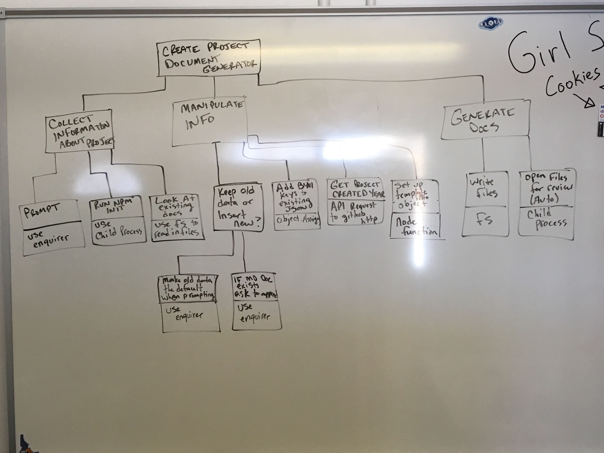

# 02 Preliminary Design

## Purpose and Overview
This is the second stage of a project. This document that is output from this stage is the Key Components Doc. The purpose of this stage is:

1. Help the developer learn how to design so that code is:
     - Maintainable
     - Scalable
     - Reusable
     - Easy to Understand
1. Fail Fast (by sharing ideas and getting feedback)
1. Distributable work (portions OR all of the project can be given out to others to do)
1. Make sure we are not starting from scratch unless we have to. (Checking approved libraries first).
1. Where we can, open the scope of the project to general use as a tool that we can add to our tool belt.


### Deliverables
1. Key Components Document [template](../02_KeyComponentsDoc.md)

### Time Estimate: 1-3 hours
- *Depending on the project and knowledge of the developer, the time estimate may differ.*

Developers should anticipate that their design will change after conversations with more senior developers. They should approach the approval process with a "How can my design be better?" attitude.

## NEW Tutorial of Process

1. Create the Magic Boxes
1. Run through checklist
1. Set up meeting with Josh/Leads


Checklist:
- Libraries
- Design patterns
- Open Scope
- What do I need to learn
- How will I learn it
- What will I do to learn it (prototypes/tutorials/research time limit?)
- What is the definition of done for my learning process

Ways to learn:
- From Josh, from Peers, from pluralsight, from prototype


Meeting with Josh/Leads:
- First 5 minutes, report to Josh/Leads (INPUT)
- Next 10 minutes discuss with Josh/Leads (FUNCTION)
- Last 5 minutes, Josh/Leads approve a learning plan


## OLD Tutorial of Process

Congratulations! If you are reading this chances are your project has made it through the Project Capture Process! Now you are ready to do some research, come up with a light weight design and prototype those parts of the design/project that you are learning (e.g. test a library that you've never used before)!  What follows are the steps of this process. The Key Components Doc will serve sort of as a worksheet as you make your way through this stage, but it will also serve as an artifact (a fancy way of saying a document that we want to keep for reference and historical purposes).


0. Create a Work Breakdown Structure (WBS) - *OPTIONAL, yet helpful*

    Creating a design can be a challenging feat, especially when working in unknown territory. It is important to note that we work in unknown territory ALL the time! After all, growth happens when we are in the unknown.

    This step is useful for breaking down projects into smaller pieces in order to learn all that needs to be done. [Click here for a short tutorial answering the question: What is a work breakdown structure?](https://www.tutorialspoint.com/management_concepts/work_breakdown_structure.htm)

    A more helpful version of the WBS would be to not only include what needs to be done, but how that step will be done as well.

    Example:

    ---

    Let's use the Yeoman document generator project, and create a WBS for everything that needs to be done.

    

    ---

0.  Create a Basic Backlog

    For each work item/function/smallest piece of your project that needs to be accomplished, *create an entry in the key components doc* of the form:
    
    **Work item/function that needs to be done** 
    - How will that be accomplished?
    - Is there a library that accomplishes this task (be sure to check the Approved Library list)?
    - What skills are needed to accomplish this task?

    or said more concisely:

    **What** 
     - How
     - Library(s)
     - Skill(s)

    Example:
    
    ---
    Using the Yeoman document generator project, we might have a list like this *in our Key Components Document*: <br><br>
    **Prompt for Project Information** 
     - HOW: Create questions using the Enquirer library
     - LIBRARY: Enquirer
     - SKILLS: Know how to use enquirer
    
    **Run NPM Init and ensure that if the user does not accept the package.Json generated from NPM INIT, then run NPM INIT again**
     - HOW: Use Child Process Library and a do-while loop
     - LIBRARY: Child Process
     - SKILLS: Know how to use Child Process to run NPM INIT and transfer output and input from the original application to a third party application and then back to the original application when the third party application has finished.
    
    **Collect information from Existing Docs**
     - HOW: First check to see if docs with the name "README.md" or "PROJECTINFO.md" exist. If they do exist, read them in.
     - LIBRARY: File System (fs)
     - SKILLS: Know how to read files using fs.
    
    **Add BYU-I keys to existing JSON**
     - HOW: Use Object.Assign to properly merge the byui keys handling cases where the BYU-I keys exist and cases where they do not.
     - LIBRARY: None
     - SKILLS: Understand the intricacies of Object.Assign.
     
     ... and the list goes on!

    *Note that the leaves of the WBS correspond to entries in the backlog.*
    
    ---

0.  List the Libraries that you will be using

    Assuming you went through the previous step, this step should be easy. All you need to do is collect all the libraries you mentioned above and put them in a list on the Key Components Doc.

    Example:

    ---
    - fs
    - enquirer
    - child process
    - http

    ---

0.  List the Prototypes Needed

    This step is FUN! Here is where you as a developer can step up to the next level. Find all the skills in this project that you do not yet have (or if you are passing this project on to someone else slash will be working with someone else, find the skills that your project teammates do not yet have).
    
    This list *on the Key Components Doc* might look something like this:
    - D3-DSV library 
    - Promises
    - C# Classes
    - FS Library

    Each of these items on the list would be items that are not familiar to at least one person on the project team.

    Once this list is constructed, expand each list item with a subheading, design a *simple* (emphasis on simple) prototype exercise that will turn into code that will not become part of the project (though the prototypes will be kept with the project for reference and sandboxing throughout the project). Do not start coding the prototypes until approval from your manager or leads. Be sure that the prototype that you choose uses that part of the library or that part of the concept that you will be using in your project. For example if I need to write a file using fs for my project, then I will make sure the prototype I design doesn't focus on reading files while leaving out writing files. Keep the prototype light weight and only focused on the skills that are needed for the project unless approval for a more in depth training prototype is granted by your manager.

    The entire output of this step will look something like this:

    ---
       - D3-DSV library
            - Use the D3-DSV library to convert a simple JSON with keys: "Name", "Favorite Smash Bros Character", "Favorite Color", "Favorite Coding Language" into a CSV file.
       - Promises
            - Create a program that reads in a file and returns a promise when the file read has completed.
       - C# Inheritance
            - Create a character class with attributes: `height`, `name`, and `weapon`. Add member functions to this class: `run()`, `fight()`, `shield()` which serve to display text on the screen. Now make 3 classes called "Wizard", "Jedi" and "Ninja" that inherit from character overwriting the `height`, `name`, `weapon`, `run()`, `fight()`, and `shield()` member variables and functions with information and functionality specific to each type of character. Note: the member functions will only display text indicating the action is taking place lets say I have an instance of a Jedi object named called "jedi" (in lowercase). If I then test `jedi.fight();` this would output text to the console which reads: "Slashes light-saber and force pushes".
       - FS Library
            - Create a program which asks for text and for a filename, then writes the text to a file with the specified filename.

    ---

0.  The Design Chart

    Using either a whiteboard or an online design tool, create a design chart that fits your project, and include the link to the picture of the chart *in the key components doc*.

    This is probably the most important part of the Key Components Doc and the entire Preliminary Design stage.

    Here are some of the different types of charts that you can create:
    
    - [Structure Chart](https://en.wikipedia.org/wiki/Structure_chart)
    - [Sequence Diagram](https://www.geeksforgeeks.org/unified-modeling-language-uml-sequence-diagrams/)
    - [Class Diagram](https://en.wikipedia.org/wiki/Class_diagram)
    - [Data Flow Diagram](https://www.lucidchart.com/pages/data-flow-diagram?a=0)
    - Other Diagram (perhaps a hybrid of some of the above that gets the design across and can be completely understood by another programmer without a verbal explanation)
   
     For many projects, chances are you will only need one chart. You may find it useful on other projects to include 2 or 3 charts to chart the design. Keep in mind that at this stage the chart(s) should only include what is necessary. That being said, make sure not to leave anything out that would be an essential part of the design! (Or to use a project management term, this design should be [lean](https://www.asme.org/engineering-topics/articles/manufacturing-design/5-lean-principles-every-should-know).)


    When you finish your design embed the design chart image *into the key components doc*.

    ```
    
    ```

And that's all! Now schedule a design approval meeting with your manager and/or team leads. Remember to go to the meeting with a "How can I improve my design?" attitude as it is very likely the design will change.


> I think that the biggest mistake people make is latching onto the first idea that 
> comes to them and trying to do that. It really comes to a thing that my folks  taught me about money. Don't buy something unless you've wanted it three times. 
> Similarly, don't throw in a feature when you first think of it. Think if there's a 
> way to generalize it, think if it should be generalized. Sometimes you can 
> generalize things too much. I think like the things in Scheme were generalized too 
> much. There is a level of abstraction beyond which people don't want to go. Take a 
> good look at what you want to do, and try to come up with the *long-term lazy way*, 
> not the short-term lazy way. - Larry Wall

